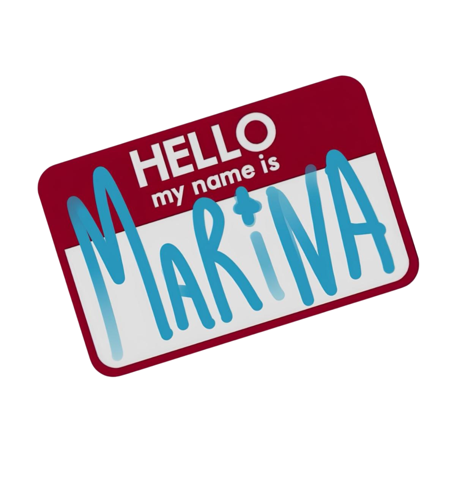

<!-- Banner  -->

**Who Am I?**

I’m a student of `Systems Analysis and Development` at the `Federal Institute of Science and Technology of Ceará` **(IFCE)**.  
My journey in technology started early: at the age of 14, I began programming small 3D games in Unity, and soon after, I immersed myself in the world of 2D games using GameMaker.  
At 15, I discovered my creative side and worked as a freelance graphic designer, which also fueled my passion for interfaces and visual aesthetics.

When I turned 18 and entered college, I fully dove into programming.  
Since then, I have been dedicating my time to studying development in depth, with a special focus on `Fullstack Web Development`.  
Although I study the complete ecosystem, my real strength and the area I enjoy exploring the most is `Front-End`, where I can combine logic, creativity, and design.

 

<!-- Gif  -->
 

<!-- A Little More About Me -->

  <h4 align="center">A Little More About Me</h4>
  

    𖦹 I enjoy being around more experienced people.   
    𖦹 My hobby is photography.    
    𖦹 I know three languages, and I'm learning the fourth one.    
    𖦹 I want to get more than one education.  
  

 ㅤ
  <!-- spotify and more --> 
  
 

  
  

  

 

<!-- My Tech Stack -->
  
 <h3 align="center">My Tech Stack</h3>

 

    

 

