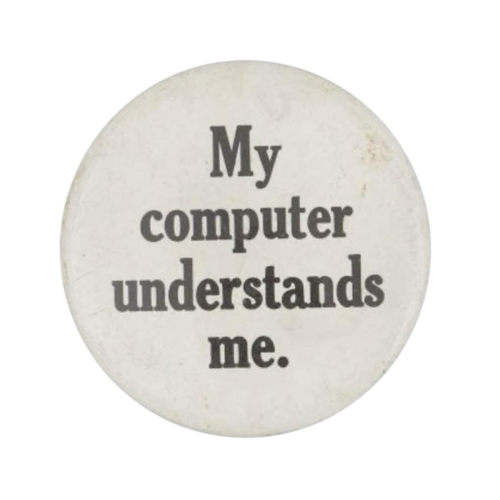

<!-- Banner -->

 

**Who Am I?**

I am a student of `Backend-developer` at the `ITHUB academy`. My immersion in this field began spontaneously: closer to 15, when passing exams and choosing a future profession I stopped at IT, although in my circle and family no one did it, I still felt sincere interest in it and risked to do it. 

To my joy my desire was not wrong, at first I studied as a programmer, but then decided that for the moment `Back-end` will be more interesting for me. Now I’m 19 years old and I’m in my fourth year of college and in the future I’m going to go to university to increase my knowledge and can get more education.

 

<!-- A Little More About Me -->
<h3 align="center">A Little More About Me</h3>

 

 𖦹 I enjoy being around more experienced people. 
 𖦹 My hobby is photography.  
 𖦹 I know three languages, and I'm learning the fourth one.  
 𖦹 I want to get more than one education  

&nbsp;&nbsp;

  <h3>Contact and other</h3>
  
  &nbsp;&nbsp;
  

<!-- My Tech Stack -->

  
  
 <h3 align="center">My Tech Stack</h3>

 

    

 
